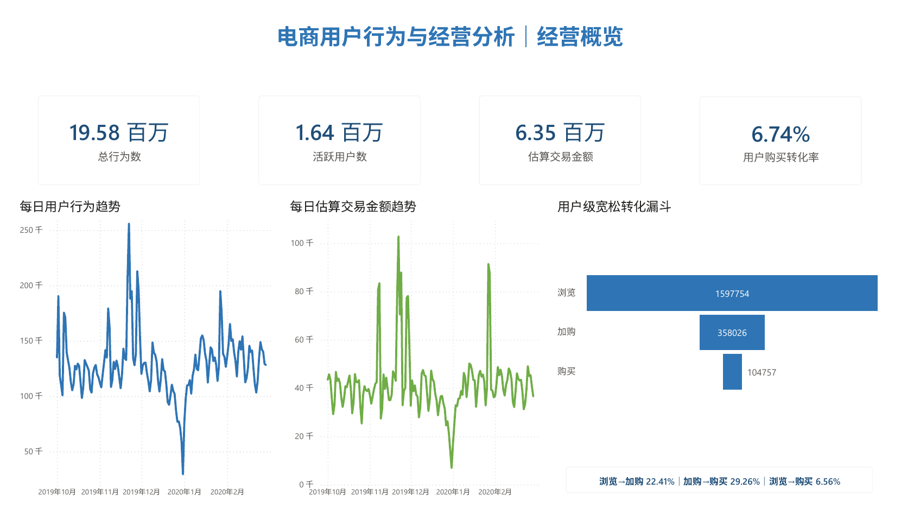
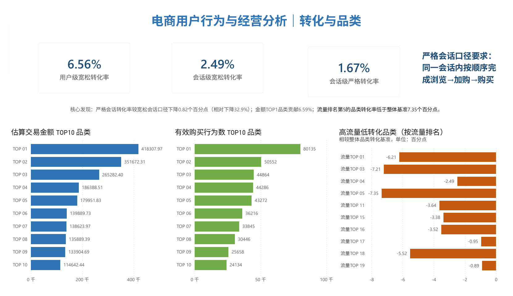
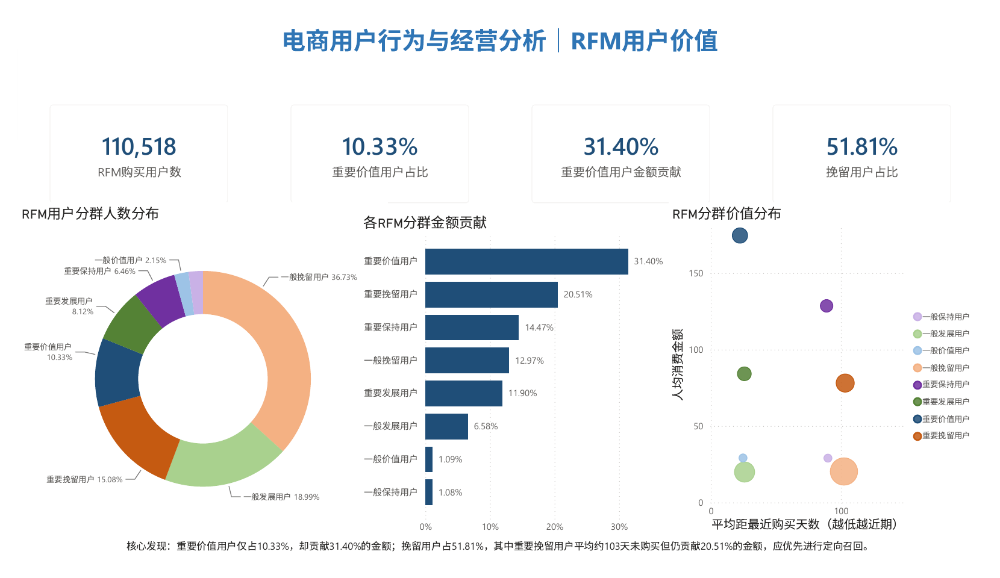

# 电商用户行为与经营分析（MySQL + Power BI）

基于约 2,069 万条美妆电商用户行为日志，完成数据审计、清洗、核心指标体系、趋势分析、三层转化漏斗、品类经营下钻、RFM 用户价值分层和 Power BI 可视化。项目使用 MySQL 8.0 与 Power BI，展示从原始行为日志、可复用分析表到业务看板的完整分析链路。

> 项目状态：SQL 分析与三页 Power BI 仪表盘已完成；性能优化实验作为后续扩展。

## 项目亮点

- 对 20,692,840 条原始行为完成重复、缺失、价格和时间字段审计，形成 19,583,742 条可分析记录。
- 同时构建用户级宽松、会话级宽松和会话级严格漏斗，明确跨会话与行为顺序对转化率的影响。
- 使用品类加权转化基准识别高流量低转化对象，并区分高购买量与高金额驱动品类。
- 根据数据分布设计 RFM 评分规则，识别重要价值、保持、发展和挽留人群。
- 使用 Power Query、DAX 与 Power BI 完成经营概览、转化与品类、RFM 用户价值三页看板。

## Power BI 看板

[查看完整三页 PDF 报告](docs/ecommerce_behavior_dashboard.pdf) · [下载 Power BI 源文件](powerbi/ecommerce_behavior_dashboard.pbix) · [查看 Power BI 设计与 DAX 说明](docs/powerbi_dashboard.md)

### 经营概览



<details>
<summary>展开查看转化与品类、RFM 用户价值页面</summary>

### 转化与品类



### RFM 用户价值



</details>

## 数据来源

- Kaggle：[eCommerce Events History in Cosmetics Shop](https://www.kaggle.com/datasets/mkechinov/ecommerce-events-history-in-cosmetics-shop)
- 时间范围：2019-10-01 至 2020-02-29
- 行为类型：`view`、`cart`、`remove_from_cart`、`purchase`
- 原始数据粒度：一行代表一次用户行为事件

原始 CSV 体积较大，不纳入本仓库。下载和导入方式见 [data/README.md](data/README.md)。

## 项目结构

```text
ecommerce_project/
├── README.md
├── data/
│   └── README.md
├── docs/
│   ├── ecommerce_behavior_dashboard.pdf
│   ├── findings.md
│   ├── metric_dictionary.md
│   └── powerbi_dashboard.md
├── images/
│   ├── dashboard_01_overview.png
│   ├── dashboard_02_funnel_category.png
│   └── dashboard_03_rfm.png
├── powerbi/
│   └── ecommerce_behavior_dashboard.pbix
├── results/
│   ├── category_amount_top10.csv
│   ├── category_purchase_top10.csv
│   ├── core_metrics.csv
│   ├── daily_metrics.csv
│   ├── data_quality_summary.csv
│   ├── funnel_summary.csv
│   ├── high_traffic_low_conversion_categories.csv
│   └── rfm_segment_summary.csv
└── sql/
    ├── 01_build_raw_table.sql
    ├── 02_data_audit.sql
    ├── 03_clean_data.sql
    ├── 04_core_metrics.sql
    ├── 05_daily_metrics.sql
    ├── 06_trend_analysis.sql
    ├── 07_funnel_analysis.sql
    ├── 08_category_analysis.sql
    └── 09_rfm_analysis.sql
```

## 执行顺序

1. 将五个月度 CSV 导入 MySQL，表名分别设置为 `2019_oct`、`2019_nov`、`2019_dec`、`2020_jan`、`2020_feb`。
2. 按编号依次运行 `sql/` 下的脚本。
3. 所有业务分析均使用清洗表 `ecommerce_clean`，原始汇总表 `ecommerce_all` 只用于审计和追溯。
4. 原始表和清洗表脚本按“一次性执行”设计；07–09 会重建对应的派生结果表，重新运行前请确认这些表未被其他流程依赖。

## 数据审计与清洗

原始汇总表共 20,692,840 条记录。审计发现：

| 问题 | 结果 | 处理 |
|---|---:|---|
| 全字段完全重复 | 1,109,098 条，5.35982% | 原表保留，分析表仅保留一条 |
| `category_code` 缺失 | 98.29% | 转为 SQL NULL，不作为核心维度 |
| `brand` 缺失 | 42.32% | 转为 SQL NULL，仅作探索分析 |
| `user_session` 缺失 | 0.0222% | 用户分析保留，会话指标自动排除 |
| 非正价格 | 104,288 条（清洗前） | 保留行为，使用 `is_valid_price` 标记 |
| 时间转换失败 | 0 条 | 从字符串转换为 DATETIME |

由于数据没有原始 `event_id`，本项目将九个业务字段完全一致的记录视为疑似重复上报。该规则属于分析假设，不代表能够还原原始埋点机制。

清洗后得到 19,583,742 条行为记录、1,639,358 名用户和 54,571 个商品。

## 核心指标

| 指标 | 结果 |
|---|---:|
| 总行为数 | 19,583,742 |
| 活跃用户数 | 1,639,358 |
| 总会话数 | 4,535,941 |
| 购买用户数 | 110,518 |
| 购买会话数 | 155,617 |
| 购买事件数 | 1,286,102 |
| 有效购买事件数 | 1,285,982 |
| 交易金额估算 | 6,348,267.70 |
| 用户购买转化率 | 6.74% |
| 会话购买转化率 | 3.43% |
| 平均购买事件金额 | 4.94 |

数据缺少 `order_id`、购买数量、订单状态和退款字段，因此本项目不将购买事件数表述为订单量，也不将交易金额估算和平均购买事件金额表述为严格 GMV 与客单价。

## 趋势发现

- 2019 年 11 月下旬为全周期表现最强阶段，行为数、购买事件、交易金额估算和每日用户转化率的 7 日移动平均同步达到高位。
- 2019 年 12 月底至 2020 年 1 月初为持续低谷。12 月 31 日行为数和交易金额分别环比下降 50.04% 和 50.94%。
- 2020 年 1 月 1 日行为数环比增长 158.25%，但主要受前一日低基数影响，不能只根据增长率判断业务已经达到高位。
- 每日行为数与交易金额估算相关系数约为 0.885，说明二者高度同步，但相关性不能证明流量增长是金额增长的唯一原因。

完整结论和解释边界见 [docs/findings.md](docs/findings.md)。

## 转化漏斗

| 漏斗口径 | 浏览→加购 | 加购→购买 | 浏览→购买 |
|---|---:|---:|---:|
| 用户级宽松漏斗 | 22.41% | 29.26% | 6.56% |
| 会话级宽松漏斗 | 18.42% | 13.51% | 2.49% |
| 会话级严格漏斗 | 13.71% | 12.15% | 1.67% |

用户级宽松漏斗允许行为跨会话；会话级宽松漏斗要求行为发生在同一会话；会话级严格漏斗进一步要求首次浏览时间早于首次加购时间，且首次加购时间早于首次购买时间。严格完整漏斗包含 71,310 个会话，占宽松完整漏斗会话的 66.95%。

## 品类经营下钻

- 清洗表中 `category_id` 完整率为 100%，共 525 个品类，因此主分析使用 `category_id`；`category_code` 缺失率约 98.25%，不用于总体品类排名。
- 金额 TOP10 品类贡献 32.52% 的有效交易金额估算。
- 有效购买事件 TOP10 品类贡献 32.15% 的有效购买事件。
- 两组 TOP10 仅有 5 个品类重合，反映出高购买量驱动与高价格驱动两种模式。
- 以浏览用户数前 25% 定义高流量品类，以 10.74% 的加权品类浏览至购买率为基准，识别出高流量低转化品类。流量排名第 5、金额排名第 2 的品类转化率仅为 3.39%，低于基准 7.35 个百分点。

## RFM 用户价值分层

RFM 使用最近购买间隔、去重购买会话数和有效购买金额进行评分。由于 78.91% 的购买用户仅有一个购买会话，F 未机械使用 `NTILE(5)`，而是根据会话次数设置固定阈值；R 和 M 使用 `PERCENT_RANK()`，避免相同取值被强行拆分。

110,518 名购买用户被划分为 8 类。四类重要用户合计占 39.99%，贡献 78.28% 的有效交易金额估算；其中 10.33% 的重要价值用户贡献 31.40%。重要保持与重要挽留用户合计贡献 34.98%，但平均最近购买间隔分别达到 89.03 天和 103.34 天，是优先召回对象。

## 使用的 SQL 技术

- `UNION ALL` 多表合并
- 条件聚合与 `COUNT(DISTINCT CASE WHEN ...)`
- CTE
- `NULLIF`、`NULLIF(TRIM(...), '')`
- `STR_TO_DATE` 时间标准化
- `LAG` 日环比
- 7 日移动平均窗口
- 日粒度预聚合表
- `MAX(CASE WHEN ...)` 用户与会话行为标记
- `DENSE_RANK`、`NTILE` 品类排名及流量分层
- `PERCENT_RANK` RFM 相对评分
- 明细表到日粒度、品类粒度和用户粒度的预聚合

## 使用的 Power BI 技术

- Power Query 字段类型校验、漏斗宽表逆透视和阶段排序
- DAX 度量值、筛选上下文、`CALCULATE`、`DIVIDE`、`FORMAT` 与 `ALL`
- 动态漏斗转化摘要、RFM 人群占比及金额贡献率
- 折线图、漏斗图、横向排名图、圆环图和 RFM 气泡散点图
- 统一页面尺寸、颜色语义、图表交互和 PDF 导出

## 当前限制

- 没有事件唯一编号，重复识别依赖全字段一致规则。
- 没有订单编号和数量，无法计算严格订单量、GMV及客单价。
- 没有渠道、活动、优惠券和库存信息，无法直接解释趋势变化原因。
- `category_code` 缺失严重；品牌分析也存在明显样本选择偏差。
- 7 日用户转化趋势是“每日转化率的 7 日平均”，不是跨 7 日重新去重后的用户转化率。
- 品类级转化采用用户级宽松口径，不限制同一会话及行为顺序。
- RFM 的 F 使用购买会话数作为购买频次代理，不等于真实订单频次。

## 后续计划

- [x] 用户级宽松漏斗：view → cart → purchase
- [x] 会话级宽松漏斗
- [x] 会话内严格顺序漏斗
- [x] 品类经营下钻与高流量低转化识别
- [x] RFM 用户价值分层
- [x] Power BI 三页仪表盘与 PDF 报告
- [ ] 在真实执行时间基础上补充性能优化实验
